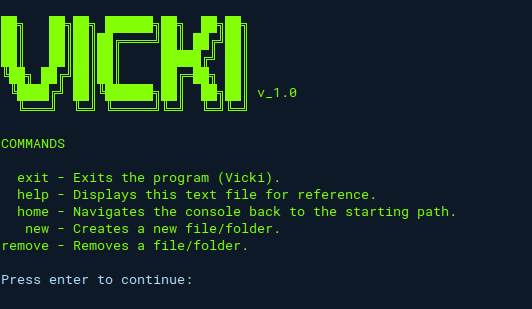
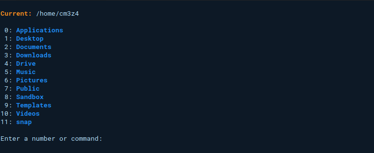

# Vicki

### Vicki is a Node.js application build to easily navigate a Unix-like/Linux system with a command-line (CLI) interface. This allows a complete beginner to use a terminal to read/create/remove files and directories without learning any basic commands. Navigating is as simple as pressing a number to change directories.

### Features
- Directory indexing for easy navigation.
- Read UTF-8 files.
- View images (png & jpg) in the terminal.
- Create text files.
- Delete files and directories.
- Setting a custom starting (home) path.
- Show hidden files.
- Show history.

### Developing Features
- Playing audio/video files.
- Copying files/directories.
- Compressing files/directories.
- Extracting files/directories.
- History logging.

### Screenshots

