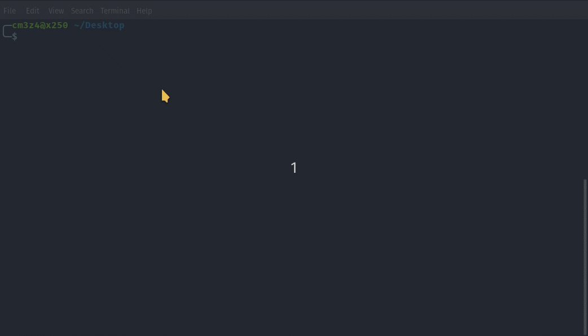

# Vicki

### Description

Vicki is a Node.js application built to easily navigate a Unix-like/Linux system with a command-line interface (CLI). This allows a complete beginner to use a terminal to read/write and remove files/directories without learning any basic shell commands. Navigating is as simple as pressing a number to change directories.

*My wife says I never do anything for her, so I named this program after her...*

### Features
- Directory indexing for easy navigation.
- Read UTF-8 files.
- View images (png & jpg) in the terminal.
- Create text files.
- Delete files and directories.
- Setting a custom starting (home) path.
- Show hidden files.
- Show history.

### Developing Features
- Playing audio/video files.
- Copying files/directories.
- Compressing files/directories.
- Extracting files/directories.
- History logging.

### Screenshots

